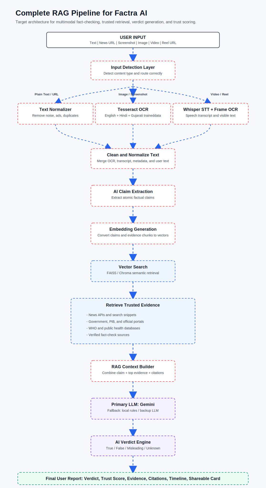
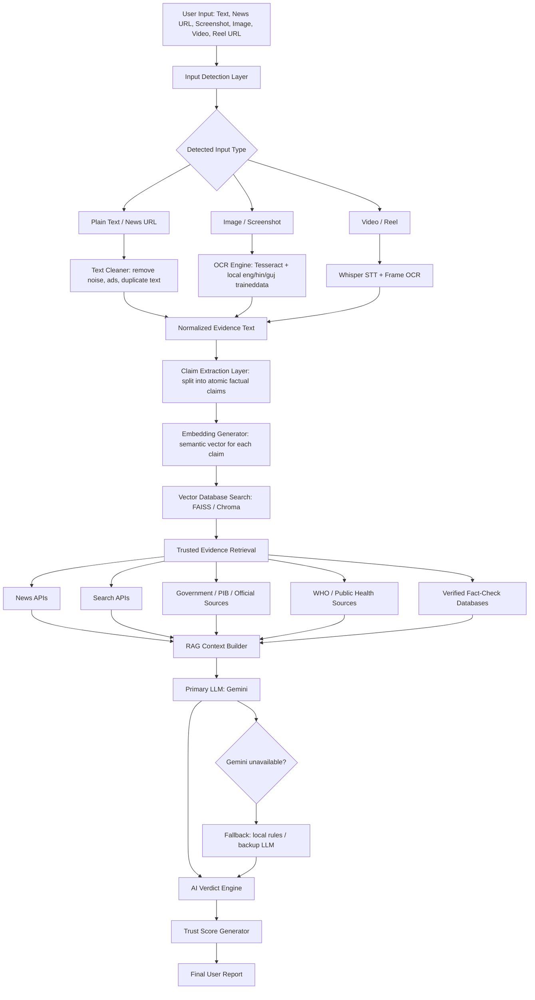

# Factra AI RAG Pipeline Design

This is the target Retrieval-Augmented Generation pipeline for Factra AI. It is designed for text, links, screenshots, images, uploaded videos, and public reel/video links.

## Pipeline Flow

## What Each Stage Should Do

| Stage | Purpose | Recommended Implementation |
| --- | --- | --- |
| Input Detection | Identify text, link, image, video, or reel URL | Existing frontend + backend payload type |
| OCR | Extract text from screenshots/images | Tesseract with local `eng`, `hin`, `guj` traineddata |
| Speech-to-Text | Extract speech from videos | `faster-whisper` local model |
| Text Cleaning | Remove OCR noise, duplicated lines, platform boilerplate | Backend normalizer |
| Claim Extraction | Split one input into multiple factual claims | Gemini with heuristic fallback |
| Embeddings | Convert each claim/evidence chunk to semantic vectors | `sentence-transformers` multilingual model |
| Vector DB | Store and retrieve trusted evidence chunks | FAISS or Chroma |
| Evidence Retrieval | Search live + stored trusted sources | Serper, NewsAPI, NewsData, official sources |
| RAG Context Builder | Combine claim with best evidence | Rerank by similarity, source, date, and trust |
| LLM Verdict | Decide true/false/misleading/unverified | Gemini using only retrieved evidence |
| Trust Score | Explain confidence | Evidence quality, recency, source reliability, claim clarity, model confidence |
| Final Report | Present result to user | Verdict card, evidence links, timeline, shareable report |

## Current RAG Gap

The current project has a working RAG-style prototype, but not a full production RAG system yet.

Completed:
- Input detection for text, links, images, and videos.
- OCR with local English, Hindi, and Gujarati traineddata.
- Whisper hook for uploaded video speech-to-text.
- Claim extraction with Gemini and fallback sentence splitting.
- Live evidence search through Serper, NewsAPI, and NewsData.
- Local vector-style ranking.
- Gemini verdict generation.
- Trust score breakdown.

Still Weak:
- Current vectors are hashed local vectors, not real semantic embeddings.
- No persistent FAISS/Chroma vector database is storing trusted evidence.
- Retrieval depends heavily on live search APIs.
- Evidence chunks are snippets, not full document passages.
- Source reliability is rule-based, not deeply verified.
- Public video/reel links cannot be transcribed unless the actual video file is uploaded.

## Best Next Implementation Order

1. Add a persistent `backend/rag/` module.
2. Add a real embedding model, preferably multilingual.
3. Add FAISS or Chroma vector storage.
4. Create a trusted evidence ingestion script.
5. Store official sources, fact-check articles, government pages, and public health sources as chunks.
6. Merge vector DB evidence with live web evidence.
7. Rerank evidence by semantic match, source reliability, recency, and directness.
8. Send only the strongest evidence to Gemini.
9. Generate trust score from the same evidence features.

